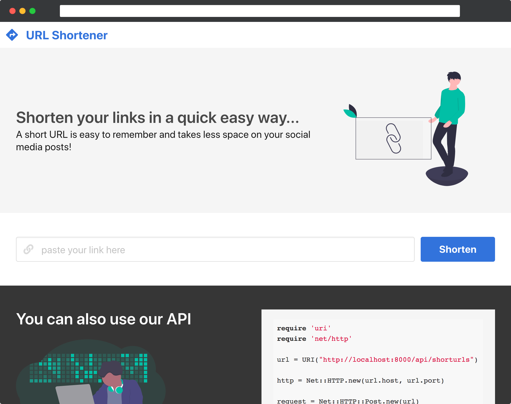

<!-- PROJECT LOGO -->
<br />
<p align="center">
  <a href="https://github.com/dafonso/url-shortener">
    
  </a>
</p>
<p align="center">
  <a href="https://github.com/dafonso/url-shortener/actions?query=workflow%3ALaravel">
      
  </a>
  <a href="https://github.com/dafonso/url-shortener/graphs/contributors">
      
  </a>
  <a href="https://github.com/dafonso/url-shortener/network/members">
      
  </a>
  <a href="https://github.com/dafonso/url-shortener/stargazers">
      
  </a>
  <a href="https://github.com/dafonso/url-shortener/issues">
      
  </a>
  <a href="https://github.com/dafonso/url-shortener/blob/master/LICENSE.txt">
      
  </a>
</p>
<p align="center"
  A simple URL shortener app done as a code challenge. 
  <br />
  <br />
  · <a href="//github.com/dafonso/url-shortener/issues">Report Bug</a>
  · <a href="//github.com/dafonso/url-shortener/issues">Request Feature</a> 
</p>


<!-- TABLE OF CONTENTS -->
## Table of Contents

* [About the Project](#about-the-project)
  * [Built With](#built-with)
* [Getting Started](#getting-started)
  * [Requirements](#requirements)
  * [Installation](#installation)
* [Testing](#testing)
* [Roadmap](#roadmap)
* [Contributing](#contributing)
* [License](#license)
* [Contact](#contact)
* [Acknowledgements](#acknowledgements)


<!-- ABOUT THE PROJECT -->
## About The Project
* Create a shortened link for a target URL
* Access stats of that link

<p align="center">
    
</p>


### Built With

* [Laravel](https://laravel.com/)
* [Vue.js](https://vuejs.org/)
* [Bulma](https://bulma.io/)


<!-- GETTING STARTED -->
## Getting Started

To get a local copy up and running follow these simple steps.

### Requirements

This is an example of how to list things you need to use the software and how to install them.
* PHP >= 7.2.5
   * BCMath PHP Extension
   * Ctype PHP Extension
   * Fileinfo PHP extension
   * JSON PHP Extension
   * Mbstring PHP Extension
   * OpenSSL PHP Extension
   * PDO PHP Extension
   * Tokenizer PHP Extension
   * XML PHP Extension
   * SQLite PHP Extension
* Composer
* npm

### Installation
 
1. Clone url-shortener repo
```shell script
git clone https://github.com/dafonso/url-shortener.git && cd url-shortener
```
2. Install dependencies
```shell script
npm install && composer install
```
3. Copy .env.example file
```shell script
cp .env.example .env
```
4. Create SQLite file
```shell script
touch database/database.sqlite
```
5. Generate a new encryption key for the app
```shell script
php artisan migrate:fresh
```
6. Run Migrations
```shell script
php artisan migrate:fresh
```
7. Run Mix and Serve app
```shell script
npm run prod && php artisan serve
```
8. Access URL Shortener app on http://localhost:8000

## Testing

```shell script
php artisan test
```

<!-- ROADMAP -->
## Roadmap

See the [open issues](https://github.com/dafonso/url-shortener/issues) for a list of proposed features (and known issues).


<!-- CONTRIBUTING -->
## Contributing

Contributions are what make the open source community such an amazing place to be learn, inspire, and create. Any contributions you make are **greatly appreciated**.

1. Fork the Project
2. Create your Feature Branch (`git checkout -b feature/AmazingFeature`)
3. Commit your Changes (`git commit -m 'Add some AmazingFeature'`)
4. Push to the Branch (`git push origin feature/AmazingFeature`)
5. Open a Pull Request

<!-- LICENSE -->
## License

Distributed under the MIT License. See `LICENSE` for more information.


<!-- CONTACT -->
## Contact

Diogo Afonso - [@dafonso](https://twitter.com/dafonso) 

Project Link: [https://github.com/dafonso/url-shortener](https://github.com/dafonso/url-shortener)

<!-- ACKNOWLEDGEMENTS -->
## Acknowledgements

* [highlight.js](https://highlightjs.org/)
* [Moment.js ](https://momentjs.com/)
* [unDraw](https://undraw.co/)


<!-- MARKDOWN LINKS & IMAGES -->
[contributors-shield]: https://img.shields.io/github/contributors/dafonso/url-shortener.svg
[contributors-url]: https://github.com/dafonso/url-shortener/graphs/contributors
[forks-shield]: https://img.shields.io/github/forks/dafonso/url-shortener.svg?style=flat-square
[forks-url]: https://github.com/dafonso/url-shortener/network/members
[stars-shield]: https://img.shields.io/github/stars/dafonso/url-shortener.svg?style=flat-square
[stars-url]: https://github.com/dafonso/url-shortener/stargazers
[issues-shield]: https://img.shields.io/github/issues/dafonso/url-shortener.svg?style=flat-square
[issues-url]: https://github.com/dafonso/url-shortener/issues
[license-shield]: https://img.shields.io/github/license/dafonso/url-shortener.svg?style=flat-square
[license-url]: https://github.com/dafonso/url-shortener/blob/master/LICENSE.txt
[product-screenshot]: public/img/screenshot01.png
[build-shield]: https://img.shields.io/github/workflow/status/dafonso/url-shortener/Laravel
[build-url]: https://github.com/dafonso/url-shortener/actions?query=workflow%3ALaravel
